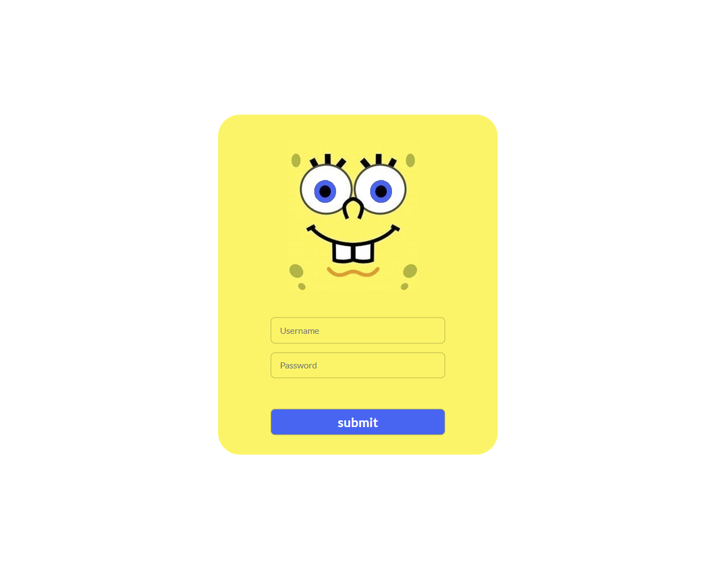
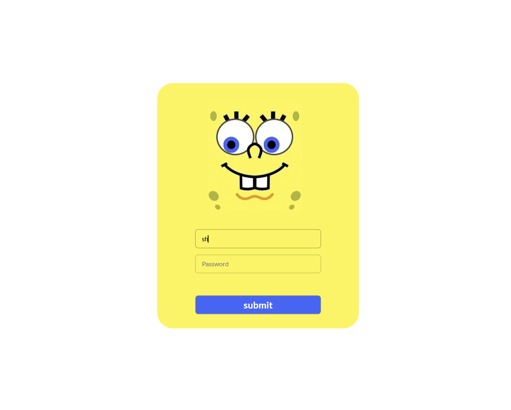
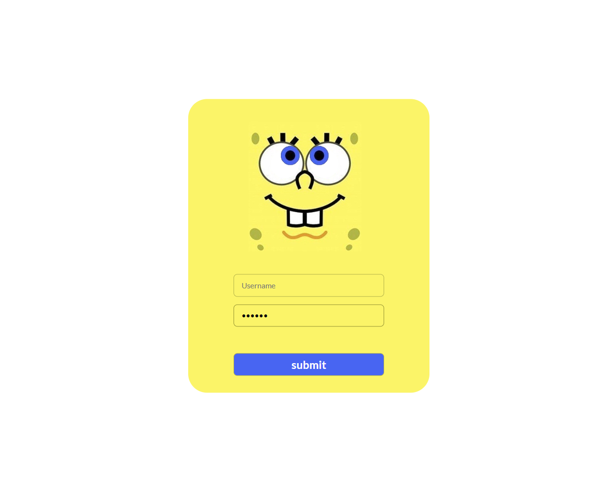

# 🧽 SpongeBob Smart Login UI

A fun and interactive **Login Form UI** inspired by SpongeBob.  
This project demonstrates how simple JavaScript animations can create engaging user experiences.

&nbsp;

## ✨ Features

- 👀 Eyes follow the cursor while typing username  
- 🔒 Eyes react differently on password focus  
- 🎨 Fully custom UI design (no frameworks)  
- ⚡ Smooth animations using Vanilla JavaScript  
- 📱 Responsive layout  

&nbsp;

## 🛠️ Built With

- HTML5  
- CSS3  
- JavaScript (Vanilla)

&nbsp;

## 📸 Screenshots

  
  

&nbsp;

## 📬 Contact

You can reach out or connect with me through the following platforms:  
Feel free to **follow me on LinkedIn**, **message me on Telegram**, or **drop me an email** — I'd love to hear from you!

  
  
  

&nbsp;

## ⭐ Support

If you like this project, consider giving it a ⭐ on GitHub!

&nbsp;

## 💡 Notes

This project is built for creativity and practice with DOM manipulation and animations using pure JavaScript.

---